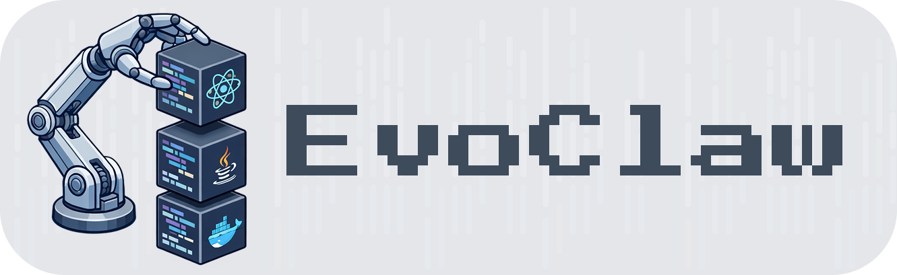
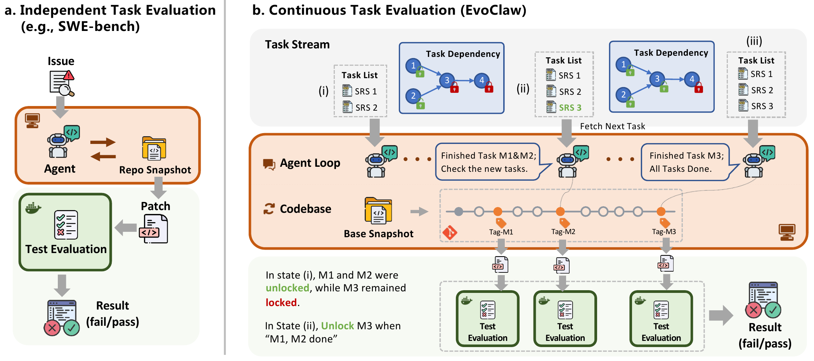
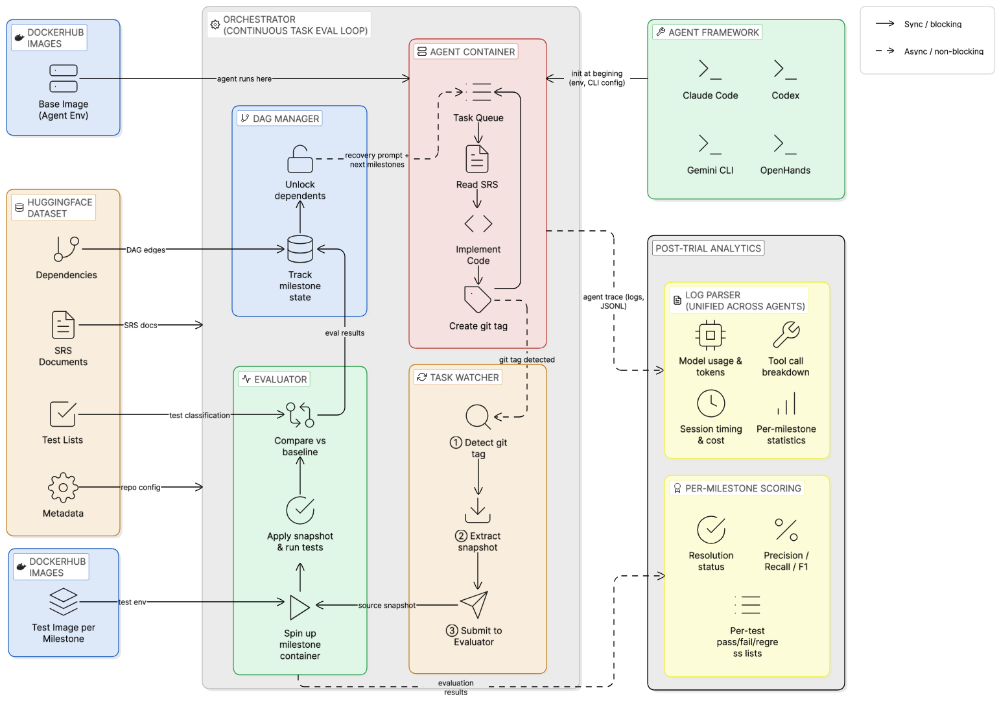

<p align="center">
  
</p>

<p align="center">
  <b>A Continuous Task Evaluation Harness for AI Agents</b>
</p>

<p align="center">
  <a href="https://evo-claw.com"></a>
  <a href="https://arxiv.org/abs/2603.13428"></a>
  <a href="https://huggingface.co/datasets/hyd2apse/EvoClaw-data"></a>
  <a href="https://hub.docker.com/u/hyd2apse"></a>
  <a href="https://opensource.org/licenses/MIT"></a>
  <a href="https://www.python.org/downloads/"></a>
</p>

---

Most existing benchmarks evaluate agents on **isolated, one-shot tasks**. But real-world workflows are not a bag of independent missions, they are continuous processes where tasks build on each other, dependencies interleave, and context accumulates over a long session.

<p align="center">
  
</p>

**EvoClaw** is a general-purpose evaluation harness for **continuous tasks**. It drops an AI agent into a working environment and challenges it to complete an ordered sequence of milestones. As the agent works, EvoClaw silently extracts checkpoints, evaluates each milestone, and asynchronously unlocks downstream tasks, enabling fine-grained, per-milestone analysis without interrupting the agent's session. 

<p align="center">
  
</p>

Currently focused on **software evolution**, EvoClaw's architecture is designed to extend to other domains.

## ✨ Key Features

- **Test Your Model**: Out of the box, EvoClaw ships with the [EvoClaw Benchmark](https://arxiv.org/abs/2603.13428) (long-horizon software evolution itineraries from 7 real-world repos) and 4 pre-configured agent frameworks ([Claude Code](https://docs.anthropic.com/en/docs/claude-code), [Codex](https://openai.com/index/codex/), [Gemini CLI](https://github.com/google-gemini/gemini-cli), [OpenHands](https://github.com/All-Hands-AI/OpenHands)). Provide a model API key and start evaluating.

- **Bring Your Own Agent**: The agent layer is decoupled from the evaluation engine (see below). Plug in your own agent by implementing a lightweight adapter. EvoClaw also provides a per-milestone analysis framework for detailed performance breakdowns.

- **Bring Your Own Data**: Supply your own task descriptions, test environments (Docker), test list for scoring, and task dependencies. EvoClaw handles orchestration, checkpoint-based evaluation, and reporting, enabling continuous task evaluation beyond coding.

## 👋 Overview

<p align="center">
  
</p>

Each evaluation trial works as follows:

1. An agent is dropped into a persistent Docker container with a workspace at a given starting state.
2. It receives a sequence of **task specifications** describing tasks to achieve.
3. Tasks are ordered by a **dependency DAG**---downstream tasks unlock as upstream ones are completed.
4. The agent signals completion by creating git tags (e.g., `agent-impl-milestone_001`).
5. A **watcher thread** silently detects tags, extracts artifact snapshots, and runs pre-defined automated validation in a separate, one-time task evaluation container.
6. Results, logs, and outcomes are automatically collected and analyzed per task.

## 🔧 Setup

**0. Prerequisites**

- Python >= 3.10
- Docker
- Model API access via environment variables: `UNIFIED_API_KEY` and `UNIFIED_BASE_URL`

**1. Installation**

```bash
git clone https://github.com/Hydrapse/EvoClaw.git
cd EvoClaw
uv sync
```

**2. Data & Docker Images**

Workspace data is hosted on [HuggingFace](https://huggingface.co/datasets/hyd2apse/EvoClaw-data). Docker images are hosted on [DockerHub](https://hub.docker.com/u/hyd2apse).

```bash
# Download workspace data
git lfs install
git clone https://huggingface.co/datasets/hyd2apse/EvoClaw-data

# Pull all repos at once
./scripts/pull_images.sh
```

> See [docs/setup.md](docs/setup.md) for the full data layout, Docker image naming conventions, and manual retag instructions.

## 🚀 Usage

**1. Configure** — copy the template and edit:

```bash
cp trial_config.example.yaml trial_config.yaml
```

```yaml
# modify trial_config.yaml 
data_root: /path/to/EvoClaw-data       # where you cloned the HuggingFace dataset
trial_name: my_experiment              # name for this evaluation run
agent: claude-code                     # agent: claude-code | codex | gemini-cli | openhands
model: claude-opus-4-6                 # model identifier
timeout: 18000                         # optional: max agent runtime per repo (seconds)
# reasoning_effort: high               # optional: low | medium | high | xhigh | max 
# repos: [navidrome, ripgrep]          # optional: run only these repos (default: all)
# max_parallel: 3                      # optional: limit parallel repos (default: all)
```

**2. Run** — evaluate across all repos:

```bash
export UNIFIED_API_KEY=sk-...
export UNIFIED_BASE_URL=https://...   # optional, for proxy or custom endpoints
python scripts/run_all.py --config trial_config.yaml
```

**3. Monitor** — check progress in another terminal:

```bash
./scripts/monitor.sh my_experiment
```

> **Tip:** If a repo's milestones appear stuck (usually due to agent framework memory or network issues), kill that repo's `run_e2e` process and resume with `python -m harness.e2e.run_e2e --resume-trial /path/to/trial_dir`. EvoClaw will continue from the latest checkpoint.

> See [docs/usage.md](docs/usage.md) for single-repo runs, resume, re-evaluation, result collection, and all CLI arguments.

## 🤝 Contributing

We welcome contributions! Whether it's adding support for new agents, new task domains, new datasets, bug fixes, or documentation improvements.

## ✍️ Citation

Welcome to cite our paper if you find EvoClaw useful!

```bibtex
@misc{deng2026evoclawevaluatingaiagents,
      title={EvoClaw: Evaluating AI Agents on Continuous Software Evolution},
      author={Gangda Deng and Zhaoling Chen and Zhongming Yu and Haoyang Fan and Yuhong Liu and Yuxin Yang and Dhruv Parikh and Rajgopal Kannan and Le Cong and Mengdi Wang and Qian Zhang and Viktor Prasanna and Xiangru Tang and Xingyao Wang},
      year={2026},
      eprint={2603.13428},
      archivePrefix={arXiv},
      primaryClass={cs.SE},
      url={https://arxiv.org/abs/2603.13428},
}
```

## 📄 License

This project is licensed under the [MIT](LICENSE) License.
